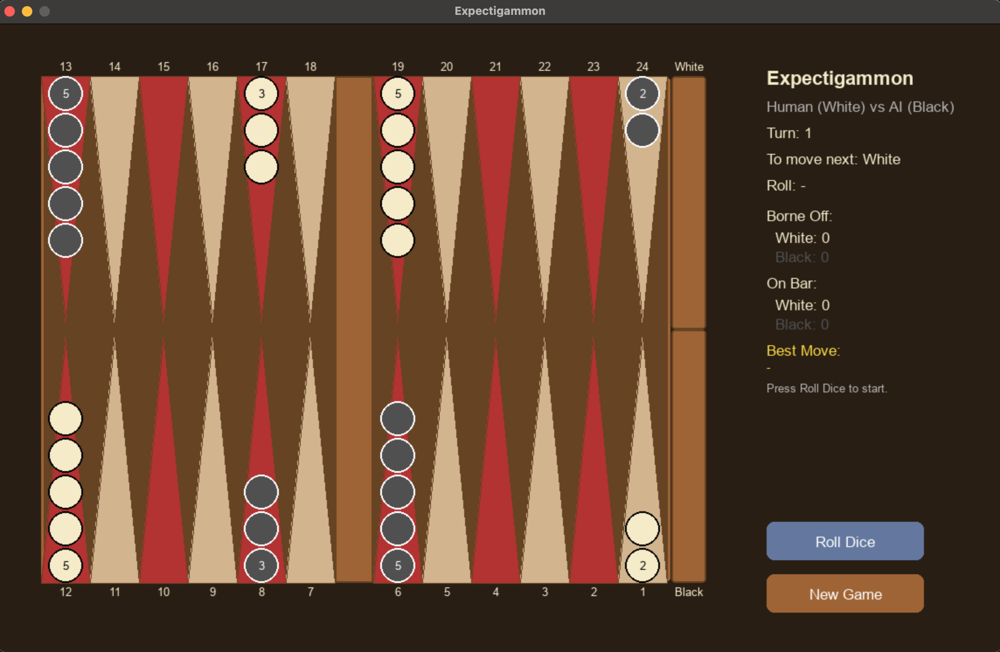

# Expectigammon
A Backgammon agent using expectiminimax search with a heuristic evaluation function. This game supports AI vs. AI
game simulation and also Human vs. AI gameplay through a graphical user interface created with Pygame (for those
who think they can take down the agent!)

## Necessary Libraries
Make sure to install the required libraries to be able to run the game.
```
pip install pygame numpy
```

## How to Run the Game
Use the graphical user interface by runnning the following command from project root:
```
python -m src.gui
```
You will be prompted to enter `1` if you want to play AI vs. AI or `2` if you want to play against the Agent

To run a number of simulation games to see some statistics over many game, run the following command from project root:
```
python -m src.expectigammon
```
This runs the `simulate()` function and prints win rates, average turns, average time, and node statistics to the terminal.
You can adjust the hyperparameters (depth and moves cap) in the expectigammon.py file to see how stats differ.

## How to Play the Game (Human vs. AI mode)
- Press **Roll Dice** to roll at the start of your turn (Your roll will appear on the right panel)
- Click a white piece to select it as the piece to move and valid destinations will be highlighted in green
- Red highlights indicate opponent blots you can hit
- Click a highlighted destination to move the piece
- Click anywhere on an empty area of the board to deselect a piece and clear highlights
- Repeat for each remaining die
- Press **Next Turn** to let the AI (Black) take its turn
- Press **New Game** to start a new game



## GUI Display
The right panel shows:
- Current turn and whose turn it is
- Dice roll
- Borne off and bar piece counts
- AI's most recently executed move sequence
- Expected value of the AI's last move where positive values are good for White, and negative values good for Black
